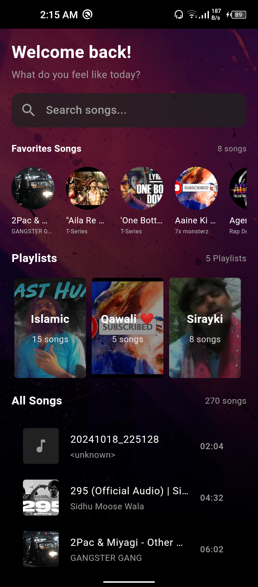

# 🎵 Music Player App

A feature-packed, elegant music player app developed with **Flutter**! Built with a focus on modern design, efficiency, and user-friendly features, this app delivers a seamless experience for all music lovers.

---

## 🚀 Features

### 🎶 Core Functionality
- **Dynamic Playlists**: Create, manage, and shuffle playlists effortlessly.
- **Favorites Management**: Mark and access your favorite tracks instantly.
- **Smooth Audio Playback**: High-quality music playback powered by **Just Audio**.

### 📚 Library Management
- **Music Querying**: Efficient library management using **OnAudioQuery**.
- **Track Metadata**: Display song details such as title, artist, album art, and duration.

### 🛠 Technical Excellence
- **GetX for State Management**: Real-time updates and efficient navigation.
- **Shared Preferences**: Persistent data storage for user settings and preferences.
- **MVC Architecture**: Clean, modular, and scalable codebase.

---

## 💡 Technologies Used

| Technology      | Purpose                          |
|-----------------|----------------------------------|
| **Flutter**     | Cross-platform mobile framework |
| **GetX**        | State management                |
| **Shared Preferences** | Local data persistence       |
| **Just Audio**  | Audio playback                  |
| **OnAudioQuery** | Music library querying         |
| **Dart**        | Programming language            |

---

🖼️ Screenshots
<table>
  <tr>
    <td>
      
    </td>
    <td>
      
    </td>
    <td>
      
    </td>
  </tr>
</table>

---

## 📂 Folder Structure
```
lib/
├── app/
│   ├── modules/
│   │   ├── home/
│   │   ├── player/
│   │   ├── playlists/
│   ├── services/
│   └── utils/
└── main.dart
```
- **Modules**: Contains the MVC structure for each screen.
- **Service**: Handles data and state management logic.
- **Widgets**: Reusable components for UI.
- **Main.dart**: Entry point of the application.

---

## 🛠 Setup Instructions

### Prerequisites
- Flutter installed ([Get Started with Flutter](https://flutter.dev/docs/get-started))
- Dart SDK installed
- Android/iOS emulator or a physical device

### Steps to Run
1. Clone the repository:
   ```bash
   git clone [repository-url]
   ```
2. Navigate to the project directory:
   ```bash
   cd music_player
   ```
3. Install dependencies:
   ```bash
   flutter pub get
   ```
4. Run the app:
   ```bash
   flutter run
   ```

---

## 📈 Learning Outcomes
- Implemented **state management** using GetX for real-time updates.
- Built a **modular MVC architecture** for scalability and maintainability.
- Integrated local storage with **Shared Preferences**.
- Enhanced proficiency in handling audio and querying libraries using **Just Audio** and **OnAudioQuery**.

---
---

## 📧 Contact
- Zuraiz NAyyar
- Email: malikzuraiz1214@gmail.com
- LinkedIn: <a href="https://www.linkedin.com/in/malik-zuraiz-nayyar-3815a8227/">Zuraiz Nayyar</a>
- GitHub: <a href="https://github.com/MalikZuraiz">MalikZuraiz</a>

Feel free to reach out for feedback, suggestions, or just to connect!

---

Enjoy the tunes! 🎵
